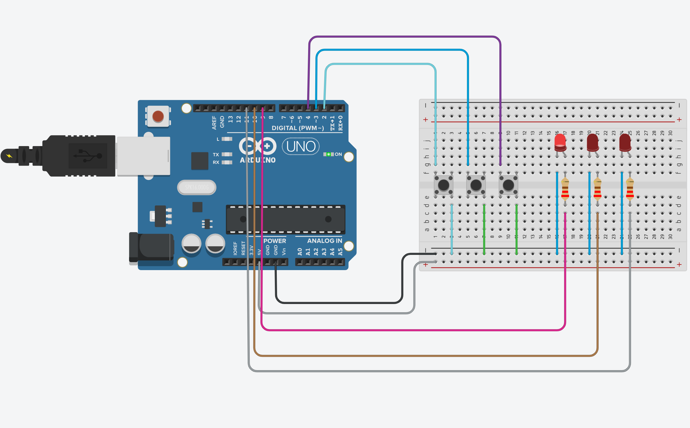
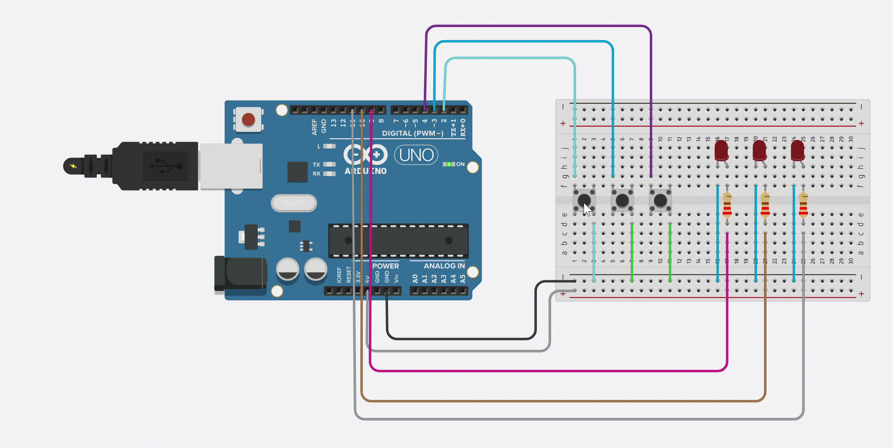

# Arduino 3-LED Button Controller

A simple Arduino project that controls 3 LEDs using 3 push buttons with toggle functionality.

  

## 🔧 Features

- **Independent Control**: Each button controls its own LED
- **Toggle Function**: Press once to turn ON, press again to turn OFF
- **Debouncing**: Prevents multiple triggers from button bounce
- **Clean Code**: Array-based structure for easy modification

## 🛠️ Components Required

- 1x Arduino Uno
- 3x LEDs 
- 3x Push Buttons
- 3x 220Ω Resistors (for LEDs)
- 3x 10kΩ Resistors (for buttons)
- Breadboard
- Jumper wires

## 📋 Circuit Connections

### LEDs:

| LED | Arduino Pin | Resistor | Connection |
|-----|-------------|----------|------------|
| LED 1 | Pin 13 | 220Ω | Pin 13 → LED+ → LED- → 220Ω → GND |
| LED 2 | Pin 12 | 220Ω | Pin 12 → LED+ → LED- → 220Ω → GND |
| LED 3 | Pin 11 | 220Ω | Pin 11 → LED+ → LED- → 220Ω → GND |

### Buttons:

| Button | Arduino Pin | Pull-down Resistor |
|--------|-------------|-------------------|
| Button 1 | Pin 2 | 10kΩ to GND |
| Button 2 | Pin 3 | 10kΩ to GND |
| Button 3 | Pin 4 | 10kΩ to GND |

**Button Wiring**: `5V → Button → Arduino Pin + 10kΩ resistor to GND`

## 🎮 How It Works

1. Press **Button 1** → LED 1 toggles ON/OFF
2. Press **Button 2** → LED 2 toggles ON/OFF  
3. Press **Button 3** → LED 3 toggles ON/OFF
4. Each LED operates independently
5. Multiple LEDs can be ON simultaneously

## 📁 Files

- `led_button_controller.ino` - Main Arduino code
- `circuit_diagram.png` - Wiring diagram
- `demo_video.mp4` - Working demonstration

## 🚀 Quick Start

1. **Wire the circuit** according to the diagram
2. **Upload the code** to your Arduino
3. **Press buttons** to control LEDs
4. **Enjoy** your LED controller!

## 🎥 Demo

*Click to watch the working demonstration*

## 🔄 Code Features

- **Debouncing algorithm** prevents button bounce
- **Array-based design** for easy scaling
- **Toggle functionality** with state memory
- **Clean, commented code** for learning

## 📖 Learning Objectives

- Digital I/O control
- Button debouncing techniques
- State management
- Array usage in Arduino
- Circuit design basics
  

## 📄 License

Open source - feel free to use and modify

